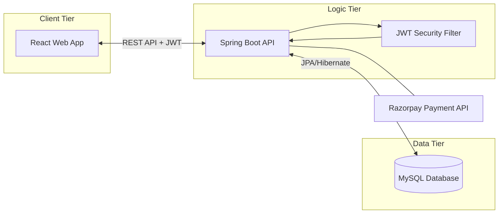
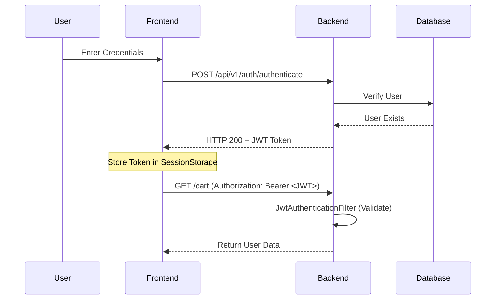

# 🌿 Organica: Full-Stack Organic E-Commerce Platform

Organica is a professional-grade, full-stack e-commerce solution built with **React**, **Spring Boot**, and **MySQL**. This platform is designed for high performance, security (JWT), and seamless scalability using Docker containerization.

---

## 🏗️ 1. System Architecture & Workflows

### 🌐 High-Level Architecture

The system follows a decoupled Microservices-like architecture where the Frontend and Backend communicate over RESTful JSON APIs.



### 🔐 Authentication & Security Workflow

The application implements **Stateful Security with Stateless Tokens (JWT)**.



---

## 🚀 2. Quick Start Guide (The Docker Way)

The most efficient way to run the entire stack is using **Docker Compose**. This ensures identical environments across different machines.

### Prerequisites

- **Docker Desktop** installed.
- **Git** version control.

### Installation Steps

1. **Clone the Project**

   ```bash
   git clone https://github.com/bandelamahesh8/Pep1.git
   cd Organica
   ```

2. **Configuration**
   Open `docker-compose.yml` and ensure your keys are set (currently using placeholders for testing):

   ```yaml
   RAZORPAY_KEY_ID: dummy_key
   RAZORPAY_KEY_SECRET: dummy_secret
   ```

3. **Launch the Application**

   ```bash
   # Build images and start containers in detached mode
   docker compose up --build -d
   ```

4. **Verify Deployment**
   ```bash
   docker compose ps
   ```
   **Access Ports:**
   - **Frontend:** [http://localhost:3000](http://localhost:3000)
   - **Backend API:** [http://localhost:9090](http://localhost:9090)
   - **MySQL:** Port 3306

---

## 💻 3. Java Spring Boot Backend Integration Guide

### 📂 Directory Structure (Server)

The backend is organized using the **Controller-Service-Repository** pattern.

```text
Server/src/main/java/com/organica/
├── config/           # JWT & Security configurations
├── controllers/      # REST Endpoints (API Layer)
├── entities/         # JPA Models (Database Tables)
├── payload/          # DTOs (Data Transfer Objects)
├── repositories/     # Database Queries (JPA)
└── services/         # Business Logic Layer
```

### 🛠️ Key Integration Components

#### 1. Security Configuration

The backend uses **Spring Security 6**. All endpoints are open by default in this configuration, but protected by the `JwtAuthenticationFilter`.

To protect a specific route, modify `SecurityConfiguration.java`:

```java
.requestMatchers("/admin/**").hasRole("ADMIN")
```

#### 2. Database Integration

We use **Spring Data JPA**. To Add a new database field:

1. Update the **Entity** class.
2. The `SPRING_JPA_HIBERNATE_DDL_AUTO: update` setting in `docker-compose.yml` will automatically update your MySQL tables.

#### 3. Handling API Requests from Frontend

The frontend uses a centralized `Axios.js` helper.

**Code Example:**

```javascript
// Located in Client/src/Helper/Axios.js
const response = await axios.request({
  url: "http://localhost:9090/product/", // Backend URL
  method: "GET",
  headers: {
    Authorization: `Bearer ${token}`, // Token-based Auth
  },
});
```

---

## 🛠️ 4. Advanced Development Steps

### Building the Backend Manually (Outside Docker)

If you have Java 17 and Maven installed:

```bash
cd Server
./mvnw clean package
java -jar target/*.jar
```

### Building the Frontend Manually

```bash
cd Client
npm install
npm start
```

---

## 🛑 5. Maintenance & Troubleshooting

### Resetting the Environment

If you face data issues or want a clean start:

```bash
docker compose down -v  # WARNING: deletes database volume
docker compose up --build -d
```

### Checking Backend Health

Check if the backend is successfully connected to MySQL:

```bash
docker logs organica-backend-1 | grep "Started OrganicaApplication"
```

---

### 🎨 Tech Stack Summary

- **UI:** React 18, CSS3, FontAwesome.
- **Server:** Java 17, Spring Boot 3.1, Maven.
- **Persistence:** MySQL 8.0, Hibernate.
- **Security:** JWT (Json Web Token).
- **Payment:** Razorpay integration.

---

### 🎨 Tech Stack Matrix

| Category               | Technology                      | Usage in Organica                                                          |
| :--------------------- | :------------------------------ | :------------------------------------------------------------------------- |
| **Frontend Framework** | **React.js (18.x)**             | Component-based UI library for a dynamic SPA experience.                   |
| **Backend Framework**  | **Spring Boot (3.1.0)**         | Robust Java framework for high-performance RESTful APIs.                   |
| **Language**           | **Java (17)**                   | Long-term support (LTS) version for the server-side logic.                 |
| **Security**           | **Spring Security & JWT**       | Secure authentication and authorization using stateless tokens.            |
| **Database**           | **MySQL (8.0)**                 | Relational database for persistent storage of products, users, and orders. |
| **ORM**                | **Spring Data JPA / Hibernate** | Simplified database operations and automated schema management.            |
| **State Management**   | **React Hooks**                 | Managing local and global UI state (useState, useEffect).                  |
| **API Client**         | **Axios**                       | Handling HTTP requests from the frontend to the backend.                   |
| **Containerization**   | **Docker & Docker Compose**     | Consistent environment and simplified multi-container deployment.          |
| **Payment Gateway**    | **Razorpay**                    | Secure integration for processing online transactions.                     |
| **Build Tools**        | **Maven & NPM**                 | Dependency management and build automation for Java and Node.js.           |
| **Styling**            | **Vanilla CSS3 & FontAwesome**  | Premium aesthetics with modern iconography.                                |

---

**Developed & Optimized by Bandela Mahesh**  
_Full Stack Organic E-Commerce Solution_
