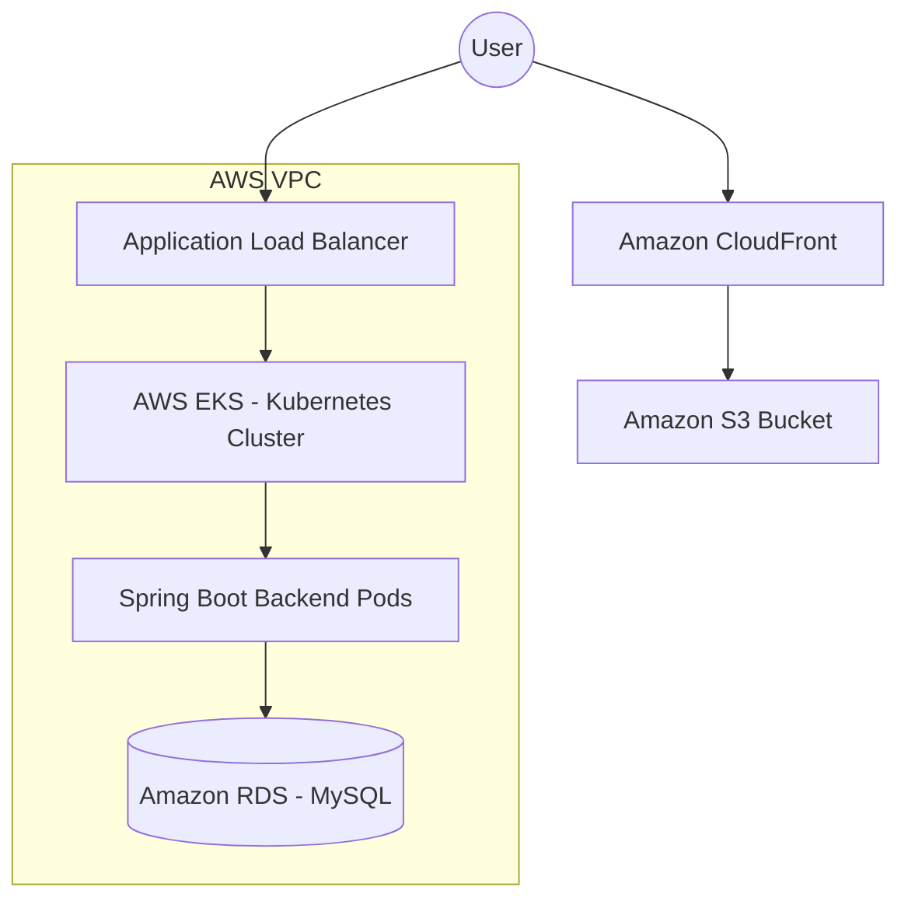
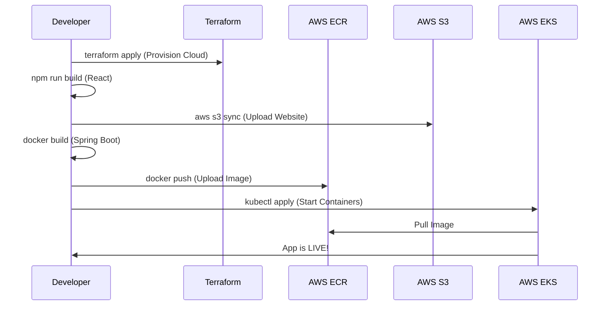

# 🚀 Organica Project - Cloud Deployment Guide

This document provides a comprehensive guide to deploying the Organica Full-Stack application to **AWS (Amazon Web Services)** using professional DevOps practices including **Infrastructure as Code (Terraform)**, **Docker**, **Kubernetes (EKS)**, and **Global Content Delivery (CloudFront)**.

---

## 🏗️ Architecture Overview

The application is deployed using a modern decoupled architecture:



| Component        | Technology               | Role                                           |
| :--------------- | :----------------------- | :--------------------------------------------- |
| **Frontend**     | React, S3, CloudFront    | Static assets hosted globally for high speed.  |
| **Backend**      | Spring Boot, Docker, EKS | Scalable API running in Kubernetes containers. |
| **Database**     | Amazon RDS (MySQL)       | Fully managed, highly available database.      |
| **Provisioning** | Terraform                | Automates the creation of all AWS resources.   |

---

## 🛠️ Step 1: Preparation & Tooling

Before deploying, ensure your local environment is ready.

### 1.1 Required Software

- **Docker Desktop**: To build container images.
- **AWS CLI**: To communicate with your AWS Account.
- **Terraform CLI**: To provision infrastructure.
- **Kubectl**: To manage the EKS cluster.

### 1.2 AWS Configuration

Run the following command to link your AWS account:

```bash
aws configure
```

_Enter your IAM Access Key, Secret Key, and set the region to `us-east-1`._

---

## 📦 Step 2: Infrastructure Provisioning (Terraform)

We use Terraform to ensure your infrastructure is reproducible and version-controlled.

### 2.1 Initialization

Navigate to the terraform directory:

```bash
cd terraform
terraform init
```

### 2.2 Execution

Deploy the VPC, EKS, RDS, and S3 resources:

```bash
terraform plan
terraform apply -auto-approve
```

**Wait roughly 15-20 minutes** for the EKS Cluster and RDS database to fully boot up.

---

## 🐳 Step 3: Backend Deployment (Docker & ECR)

The backend must be packaged as a Docker image and stored in the **AWS Elastic Container Registry (ECR)**.

### 3.1 Authentication

```bash
aws ecr get-login-password --region us-east-1 | docker login --username AWS --password-stdin <AWS_ACCOUNT_ID>.dkr.ecr.us-east-1.amazonaws.com
```

### 3.2 Build & Push

```bash
# From the Organica root directory
docker build -t organica-backend ./Server
docker tag organica-backend:latest <AWS_ACCOUNT_ID>.dkr.ecr.us-east-1.amazonaws.com/organica-backend:latest
docker push <AWS_ACCOUNT_ID>.dkr.ecr.us-east-1.amazonaws.com/organica-backend:latest
```

---

## ⚛️ Step 4: Frontend Deployment (S3 & CloudFront)

The React app is built into static files and synchronized with an S3 bucket.

### 4.1 Build Production Bundle

```bash
cd Client
npm install --legacy-peer-deps
npm run build
```

### 4.2 Sync to AWS

```bash
aws s3 sync build/ s3://organica-frontend-assets --delete
```

_CloudFront will automatically start serving the files from the S3 bucket._

---

## ☸️ Step 5: Orchestration (Kubernetes/EKS)

Finally, we tell Kubernetes to pull the backend image and connect it to the RDS database.

### 5.1 Connect to Cluster

```bash
aws eks update-kubeconfig --region us-east-1 --name organica-cluster
```

### 5.2 Deploy Manifests

```bash
kubectl apply -f k8s/aws-backend.yaml
```

---

## 🔄 Deployment Workflow Summary



---

## 📝 Maintenance & Logs

- **View Backend Logs**: `kubectl logs -l app=backend`
- **Scale Backend**: `kubectl scale deployment organica-backend --replicas=5`
- **Update App**: Re-run Step 3 and then run `kubectl rollout restart deployment organica-backend`.

---

> [!IMPORTANT]
> To automate this entire process, I have also provided the **deploy_aws.ps1** script in the root directory. You can run `./deploy_aws.ps1 -AWS_ACCOUNT_ID <YOUR_ID>` to execute these steps automatically.
